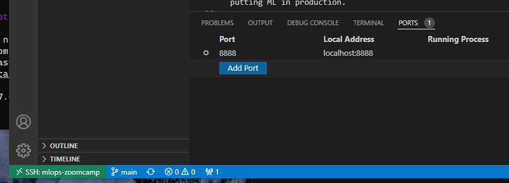

# What is ML-Ops
## Intro
Course will focus on productionizing a model to predict trip duration based on nyc taxi data, based on an API endpoint

ML model deployment steps:

1. Design
2. Train
3. Operate

Set of practices for automating and working together as a team to put ML in production:
* Reproduce result
* Easily deploy
* Quickly experiment and iterate models

## Environment setup
### Connect to AWS EC2 instance
Course will SSH (secure shell) into EC2 instance to use a virtual machine.
acct email: vyk92

Create EC2 instance, and use key pair for security. This downloads a `.pem` file to be used as the `IdentityFile` in the `ssh -i` parameter.

EC2 config:
* name: `mlops-zoomcamp`
* image: ubuntu
* architecture: 64-bit (x86), so not ARM.
* instance type: t2.micro (free tier eligible)
* key pair (login): kohada, created with .pem
* network: default (allow SSH from anywhere)
* storage: 1 x 30 GiB of gp2 (gen purpose SSD)
* everything else default.

Config edit to SSH to AWS' EC2 instance. Note the HostName IP will change every time a new instance is created.

Keep the .pem in ~/.ssh

```bash
Host mlops-zoomcamp
		# public ipv4 addr
        HostName 18.139.0.15
        User ubuntu
        # NOT "IdentifyFile", and use full url
        IdentityFile /home/kohada/.ssh/kohada.pem
        StrictHostKeyChecking no
```

This creates an *alias* for our SSH so we can type `ssh mlops-zoomcamp` and all info above will be supplied to SSH to create the connection.

This must be made in `~/.ssh/config` file

Note that `.` in front of `.ssh` denotes that it is a *hidden* directory, so it doesn't show up by default with `ls`. Requires `-a`, and signifies it as a configuration folder

### Software setup
Base EC2 ubuntu image is bare, except for python 3.10. Once SSH'd inside EC2 instance, install the following

1. Anaconda3
```bash
# downloads installer for linux
wget https://repo.anaconda.com/archive/Anaconda3-2022.05-Linux-x86_64.sh
bash Anaconda3-2022.05-Linux-x86_64.sh
# yes to default install loc, and conda init
# reset connection to see changes to current env
# upon re-conn, should see (base) in cmd prompt
# which python should point to the anaconda dir

# will show difference that conda init has made to .bashrc
# which added anaconda3 to PATH
less .bashrc

```
2. docker
```bash
# ubuntu
sudo apt update
sudo apt install docker.io


# in amazon linux, yum replaces apt
sudo yum update -y
sudo amazon-linux-extras install docker
sudo service docker start

# For both cases:
# add current user to `docker` group to run docker without sudo
# make group
sudo groupadd docker
# add user
sudo usermod -aG docker $USER
# update changes
newgrp docker
# try
docker run hello-world

```
3. docker-compose (comes separate for linux, vs windows which has both)
```bash
mkdir ~/soft
cd soft/

# note the specific version matches the VM arch we picked when creating 
# our EC2 instance
wget https://github.com/docker/compose/releases/download/v2.5.1/docker-compose-linux-x86_64 -o docker-compose
# make it executable
chmod +x docker-compose
# modify PATH to include the ~/soft dir
# so that docker-compose is callable from anywhere
nano ~/.bashrc

# add this;
export PATH="${HOME}/soft:${PATH}"
source ~/.bashrc


```
4. Clone the `mlops-zoomcamp` repo
	1. Code > HTTPS
		1. amazon linux requires `sudo yum install git` before `git clone `
	2. note that SSH enables PUSH; HTTPS only allows PULL
5. Connect VS Code to EC2 instance via SSH
	1. okay this part was a little convoluted because I put the .ssh/config and .pem in my WSL directory, but to connect VS Code via SSH, I can't do it while I'm already remoting into WSL. So I created the .ssh/config in c/users/Kohada, and copied my .pem to /ssh
	2. At which point, the remote-SSH extension recognized the alias and allowed the SSH connection.
6. Jupyter notebook on remote
	1. in the anaconda environment, make the `~/notebooks` dir, and run `jupyter notebook`
		1. note that if you're not in the anaconda base env, `jupyter` will not be a recognized command
	2. How do we access this notebook? When we run locally, we go to `localhost:8888` but we're running on remote, not localhost. 
		1. Solution is to *port forward*. 
		2. Easiest is via VS code:
		3. 
		4. Another way is to add `LocalForward SSH_PORT localhost:HOST_PORT` under the `mlops-zoomcamp` alias in `~/.ssh/config`
		5. By default, *Token authentication* is enabled, so we can enter the token, or we use the url that's pre-completed with the token, from the CLI when we ran `jupyter notebook`
		6. Create new notebook named `duration-prediction`
			1. `!python -V` to confirm python version
			2. `import pandas as pd` to see that anaconda's packages are present.
7. Exit SSH with `~` and enter

## Reading parquet
Download nyc taxi data from [here](https://www1.nyc.gov/site/tlc/about/tlc-trip-record-data.page). Look for green_trip data for 2021-01 and 2021-02
```bash
# SSH'd to EC2 instance
mkdir -p ~/notebooks/data
cd ~/notebooks/data

# download
wget https://s3.amazonaws.com/nyc-tlc/trip+data/green_tripdata_2021-01.parquet
wget https://s3.amazonaws.com/nyc-tlc/trip+data/green_tripdata_2021-02.parquet

# confirm file existence
ls -lh

# output
total 2.4M
-rw-rw-r-- 1 ubuntu ubuntu 1.3M May 12 15:47 green_tripdata_2021-01.parquet
-rw-rw-r-- 1 ubuntu ubuntu 1.1M May 12 15:47 green_tripdata_2021-02.parquet

```
Parquet tends to be much more compressed than .csv files.

Seeing an issue where my SSH disconnects and is unable to reconnect. Search suggests the instance has been **isolated**, which typically is due to some security trigger condition to contain the instance from the rest of the cluster. Anyway this doesn't let me reconnect without stopping and restarting the instance, forcing me to switch IP addr in the SSH config file.

## Training ride duration prediction model with LinearRegression
asdf

## Course overview
### Module training process
Experimentation of different models on notebooks. Messy. Re-execute codes a bunch of times. Cells out of order. Record results in md cells or spreadsheets.

### Experiment tracking
We need a standardized way of tracking and logging the experiments. This brings up **Experiment tracking and model registry**. Tool called *MLflow* will be used.

### Pipeline
Because cells can be re-arranged and re-run in different orders it's a pain to remember exactly how the dataset was processed. A formal pipeline can be formed to:
1. load and prep data (clean, feature engineer, train v. validation v. test, kfold)
2. vectorize to an agreeable format
3. train model

### Deployment
The output of the pipeline is a trained model which we deploy as a *service* that users can access, e.g. webservice

### Monitoring
After deployment, we must monitor for performance - is the model performing as expected? Can we automate troubleshooting responses, or re-training the model based on new data?

### Best practices
* github
* CI/CD
* package in docker
* testing

### Processes
Beyond tools there are formalized ways of doing things, collaborating with others

## MLOps maturity model
[reference here](https://docs.microsoft.com/en-us/azure/architecture/example-scenario/mlops/mlops-maturity-model)

Useful framework for thinking about which project needs to be at what level

### 0 - No MLOps, no automation
* Everything in notebooks
* Appropriate for PoCs (proof of concept)

### 1 - DevOps, No MLOps
* Releases are automated
* SWE best practices
	* CI/CD
	* unit and integration tests
	* Ops metrics
* Engineering separated from data science
* NO exp tracking
* NO reproducibility
* Ready PoC, about to go to production

### 2 - Automated training
* training pipeline
* experiment tracking - performance of each model
* model registry - snapshots of each trained model
* *low friction deployment*
* DS collaborating with engineering
* suited when multiple models are in use

### 3 - Automated deployment
* *Easy-to-deploy* models, e.g. place to host ML model (platform), perhaps relies on API
* A/B test - serves some request with model 1, some with 2
* *Model Monitoring* is part of deployment, which means model re-training
* One critical case, or 5+ cases

### 4 - MLOps
* Automatic training and *re-training*
* A/B test can automatically decide which model is better to serve
* Automatic deployment and easy monitoring
	* verbose, centralized metrics from production models
* Aims for zero downtime
* Not all models need to be at this level
	* consider resources

