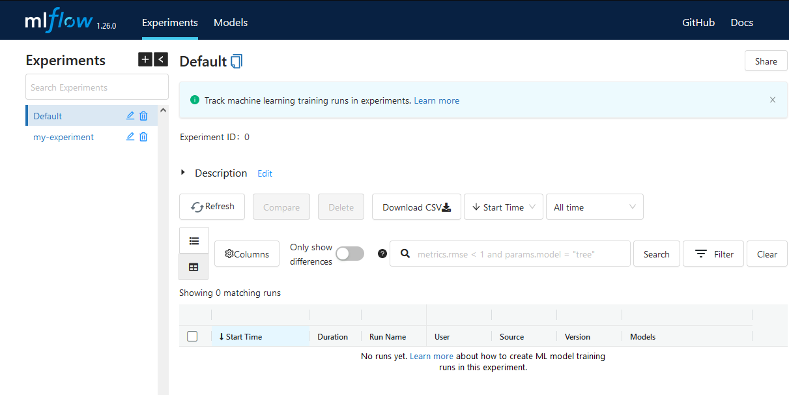
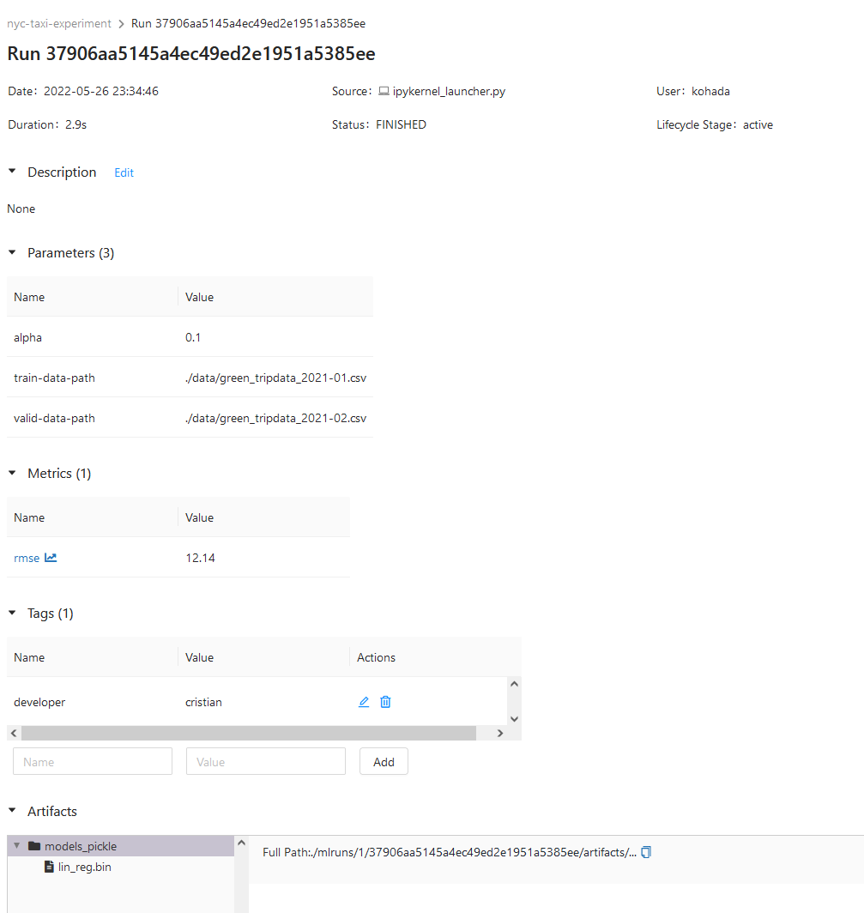
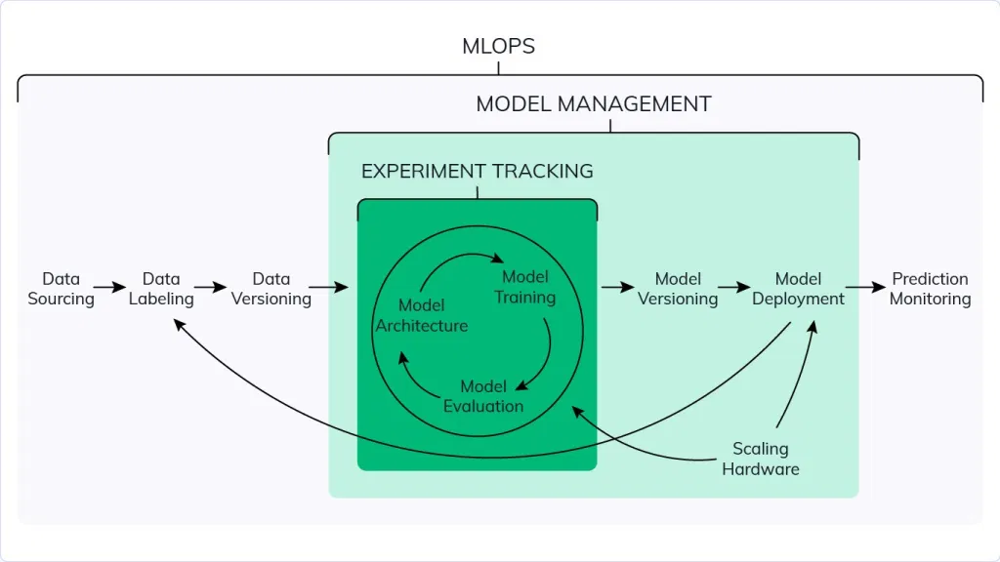

# Experiment tracking with MLFlow
Main concepts:

* ML experiment - process of building ML model
* Experiment run - each trial in the ML experiment
* Run Artifact - any files associated with an experiment run
* Experiment metadata - external info related to the experiment, e.g. dates, runtime

## Experiment tracking
Process of tracking **relevant info from ML experiment**:
* src code
* env
* dataset
* model (pickled or otherwise)
* hyperparams
* metrics for each set of model/hyperparams

Why is tracking important?

* Reproducibility
* Organization
* Optimization

Level 0: tracking in spreadsheets

* error prone
* no standard format
* low visibility
* difficult to share and collaborate upon
	* If another person continued working on it, it may be difficult to pick up on whatever standard/format the previous person used

### MLflow
It's an [open source platform](https://mlflow.org/) for ML lifecycle, installed as with any pypi package and includes these modules

1. Tracking
2. Models
3. Model Registry
4. Projects

### Tracking
MLflow organizes our experiments into **runs**, each run with their own:

* parameters
* metrics
* metadata
* artifacts (output files associated with the run, e.g. .pkl model, .png, .parquet)
* models

Additional info and logging:

* source
* version of src
* start/end time
* author

The Tracking component is an API and UI for logging the above. For us we'll use python, but it can also be done via REST/R/Java API

To start the UI, run in bash: `mlflow ui` and go to `localhost:5000`



## MLflow
Create env with the requirements.txt. I lumped it in `mlops` env.

### Setup
In bash, start the UI and set the backend to use sqlite. This initializes `mlflow.db` in the same dir as the notebook

```bash
cd <notebook_directory>
mlflow ui --backend-store-uri sqlite:///mlflow.db
```

In our `prediction.ipynb`, import mlflow with:

```python
import mlflow

# URI to record mlflow runs. Can be remote server
mlflow.set_tracking_uri("sqlite:///mlflow.db")
# naming our experiment
# check UI after running
mlflow.set_experiment("nyc-taxi-experiment")
```

UI will now display `nyc-taxi-experiment` on the left pane

Running our model definition and training within the `mlflow.start_run()` context:

```python
with mlflow.start_run():

    mlflow.set_tag("developer", "cristian")

    mlflow.log_param("train-data-path", "./data/green_tripdata_2021-01.csv")
    mlflow.log_param("valid-data-path", "./data/green_tripdata_2021-02.csv")

    alpha = 0.1
    mlflow.log_param("alpha", alpha)
    lr = Lasso(alpha)
    lr.fit(X_train, y_train)

    y_pred = lr.predict(X_val)
    rmse = mean_squared_error(y_val, y_pred, squared=False)
    
    mlflow.log_metric("rmse", rmse)

    mlflow.log_artifact(
	    local_path="models/lin_reg.bin", 
	    artifact_path="models_pickle")
```

We'll find the saved infos in the mlflow ui:



### Tracking with MLflow
See `duration-prediction.ipynb` for notes

## Model Management


## Model Registry
Marks models as one of the following 

* staging
* production
* archive

These are only *labels*, not actual deployment

`MlflowClient` class manages both the 

* MLflow tracking server which creates and manages experiments and runs
* MLflow registry server that creates/manages *registered* models and model *versions*.

Instantiate by passing the tracking and/or registry URI (e.g. sqlite path) 

```python
from mlflow.tracking import MlflowClient

# uri in same folder as the notebook/script
MLFLOW_TRACKING_URI = "sqlite:///mlflow.db" 

# instantiate
client = MlflowClient(tracking_uri=MLFLOW_TRACKING_URI)
```

## MLflow in practice
Three scenarios:

1. Single user in ML comp
	1. Local tracking server
	2. Registry is pointless; no need to push to production
2. cross-func team with one user working on ML model
	1. Local tracking server to share info with team
	2. Local or remote registry
3. multiple users on multiple ML models
	1. Sharing info is essential
	2. Remote tracking and remote registry server

### Configuring MLflow
* backend
	* `--backend-store-uri`
	* local filesystem (default)
	* SQLAlchemy compatible DB, e.g. sqlite
* Artifacts store
	* `--default-artifact-root`
	* local filesystem (default)
	* cloud storage, e.g. gcp or s3 bucket
* Tracking server
	* no tracking
	* localhost
	* remote

## Summary
### Remote tracking server
Deploy to cloud (running on VM and expose the port). Share experiments, collaborate.

### Practical considerations

* security - access to VM instance that's running the server must be restricted, e.g. through VPN
* Scalability
	* Managed solution e.g. AWS Fargate or Company Scale
* Isolation
	* Need to define standard for naming experiments, models, set of default tags
	* Lots of metadata overhead
	* Access to artifacts (stored on s3, maybe) must be restricted

### Limitation
* Open source version has no authentication
* Full reproducibility require versioning of *datasets*. MLflow does not have built-in solution, and so requires work around
* Model and data monitoring is outside MLflow's scope.

### Managed MLflow
Free for individuals, below usage quota
* Neptune
* Comet
* Weights & Biases (W&B)
* Databricks (paid) includes managed MLflow