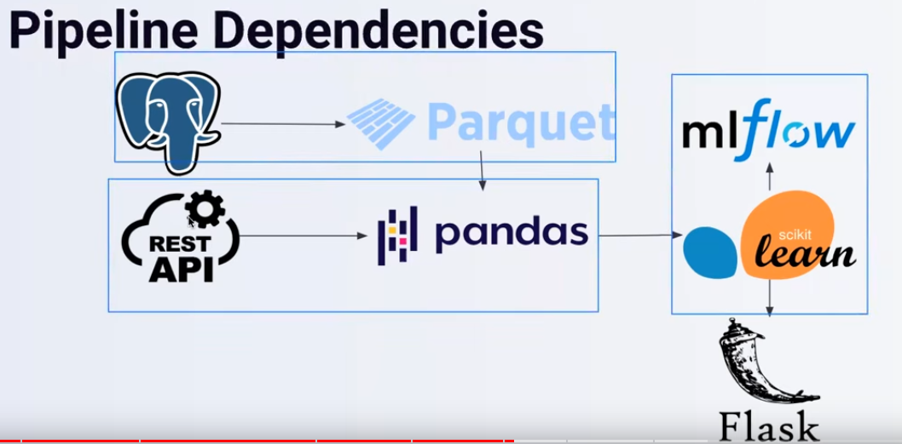
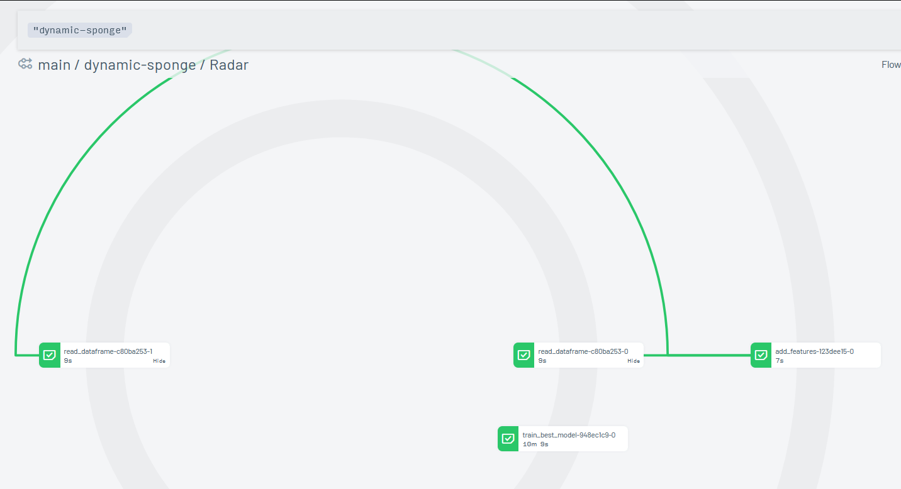
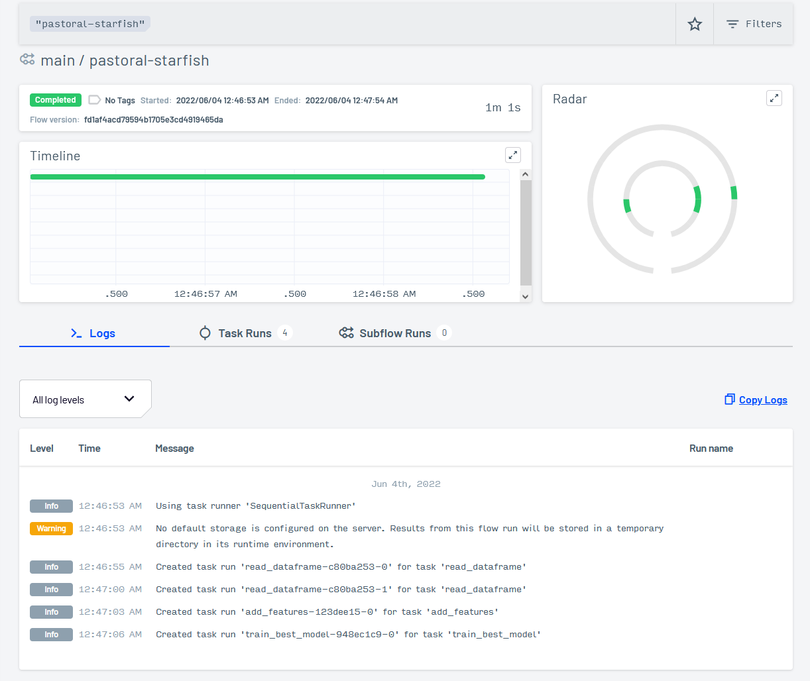
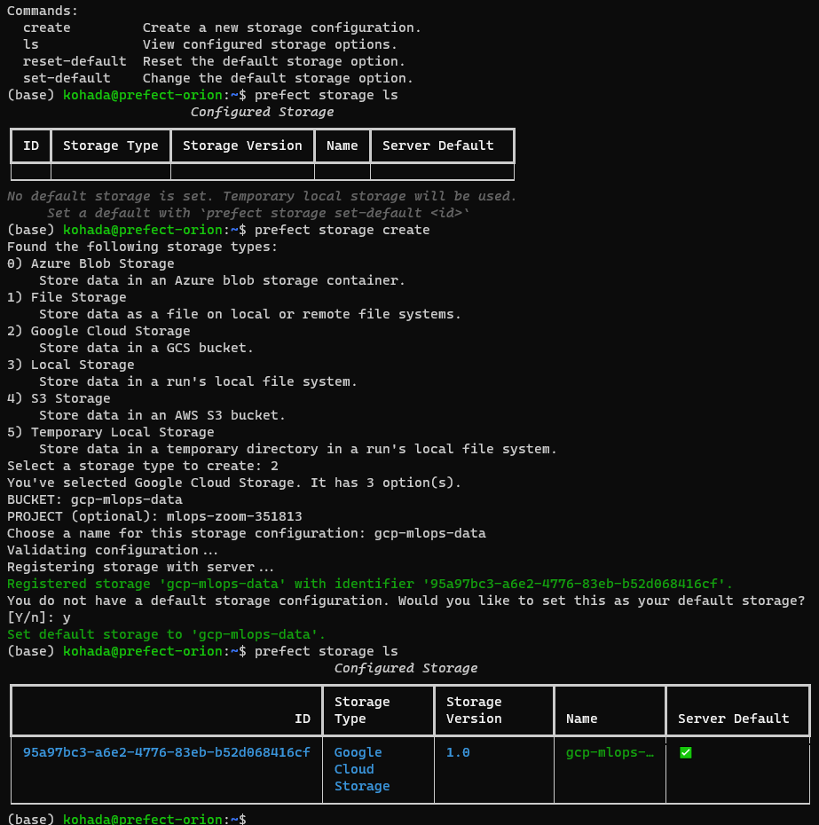
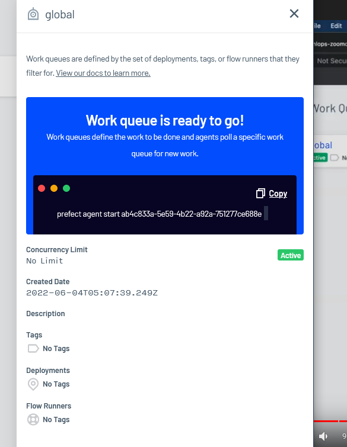
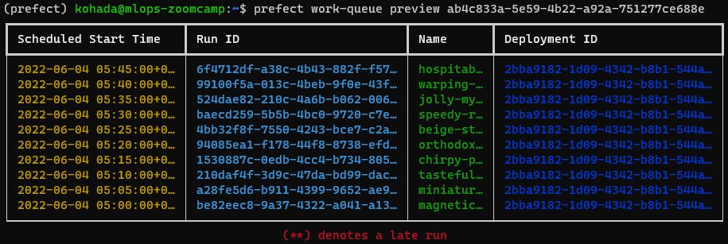

# Orchestration with Prefect 2.0

## Setup

### Install

In `/mlops-zoomcamp/03-orchestration`, edit the req.txt to remove prefect (to be installed with pip later), and create new env with `conda create -n orchestrate --file requirements.txt` 

Install with `pip install --upgrade --no-cache-dir "prefect==2.0b5"`, per official docs: [Installation - Prefect 2.0](https://orion-docs.prefect.io/getting-started/installation/). Latest version is not yet available on conda-forge

* Note that mixing conda install and pip is not best practice but in this case is unavoidable. In these situations, use conda install for what we can, and pip at the end.
* To use the environment specific kernel in jupyter, instead of the base, do this in terminal:

```bash
$ conda activate cenv           # . ./cenv/bin/activate in case of virtualenv
(cenv)$ conda install ipykernel # should already be installed
(cenv)$ ipython kernel install --user --name=<any_name_for_kernel>
(cenv)$ conda deactivate
```

* Set `name_for_kernel` to be something related to the specific env
* Refresh jupyter to see it as a new kernel option

### Server

Note that hosting prefect server in `.micro` instance will exhaust memory if run in conjunction with jupyter lab or mlflow (remote tracking/registry server).  I think each of them needs to be run on its own instance, and network the servers together.

```bash
## On cloud VM
## Open port 4200 and allow all traffic from 0.0.0.0/0
## pip install prefect==2.0b5
## Set UI_API_URL
prefect config set PREFECT_ORION_UI_API_URL="http://<external-ip>:4200/api"

## Start orion
prefect orion start --host 0.0.0.0

## On local machine, connect to remote orion server
prefect config set PREFECT_API_URL="http://<external-ip>:4200/api"

## Remote UI available at :4200/
```

### Basic Concepts

#### Flows

Basic prefect object. Container for workflow logic. `@flow` to designate flows.

*Subflows* are created when a flow is invoked within the execution of another flow (the parent flow). Acts as a regular flow in backend, and creates new task runner/tasks. Simple data passing from parent to child flow

#### Tasks

Function representing discrete unit of work. Not required; workflows can consist only of flows, but tasks can encapsulate workflow logic in units that can be reused. Specifically they receive metadata about upstream dependencies, and state of those dependencies before running. Enables waiting on completion of another task before executing, for example.

Automatic logging capture details e.g. runtime, tags, state.

Define within modules and import for flow definitions

Uses `@task` decorator to denote a function as task.

#### States

Metadata objects on status of task *runs* or flow *runs*, i.e. instances of those tasks and flows. State contains info like

* task is scheduled to make 3rd attempt within the hour
* task success, and returned data
* task was scheduled, but later cancelled
* task used cached result vs re-running
* failed due to timeout

## Workflow Orchestration



`sklearn` could store artifacts and register models to `mlflow`, and deploy to `flask` endpoint.

The thing about workflow orchestration beyond scheduling is handling failures between the nodes

### Negative Engineering

Working to mitigate failure. Job description may be to build pipelines, but majority of time is spent on making sure the pipelines work, by working on things that handle:

* retries if APIs are down
* malformed data
* notification
* observability into failure
* conditional failure logic
* timeouts

## Prefect

Aims to reduce negative engineering so there's more time for value-added work.

### Intro

* Traditional pipelines depended on DAG. Prefect 2.0 (Orion) changes that paradigm.
* Prefect Cloud is managed; Server is hosted locally

Refactor the nyc-trip-prediction notebook into a prefect workflow - `model_training.py`

### Converting pipeline to prefect flow

* Break each part of `model_training.py` into its own function
* Call them sequentially in an aggregate function `main`, which we will decorate with `@flow`
* Running even without `prefect orion start` will record the status of the flow runs.
* Add `@task` for each of the non-main functions
  * When calling functions decorated with `@task`, i.e. `X_train, X_val, y_train, y_val, dv = add_features(train_path, val_path)`, we need to add `.result()`, so it becomes `X_train, X_val, y_train, y_val, dv = add_features(train_path, val_path).result()`
  * Idea is that we're calling the `future` of that specific `task`.
  * Cannot call *tasks from within tasks*. 
    * Our `add_features()` used `read_dataframe()`, but since we also decorated `read_` with `@task`, we can no longer call it. 
    * Instead, call `read_` in the `main`, and feed the results into `add_features`
  * default `flow_runner` is called `ConcurrentTaskRunner()`
    * But if our tasks are sequentially dependent, we can assign `SequentialTaskRunner()` when decorating `@flow()`
  * By *hinting* our variable types when defining functions, the `@flow` decorator is able to raise error if the input variable types do not match the hint.
* Start orion server to visualize the flows
  * There's supposed to be a radar chart
  * Oh it's here. It just took a long time for it to load.
  * Slow even with 16GB VMs. 
  * Try hosting on cloud. [Open Beta](https://orion-docs.prefect.io/ui/cloud-getting-started/)



## Remote Prefect Server

Prefect server will run on a separate VM instance. Allow HTTP and HTTPS traffic, and open port 4200.

```bash
gcloud compute instances create prefect-orion \
    --project=mlops-zoom-351813 \
    --zone=us-central1-c \
    --machine-type=e2-micro \
    --network-interface=network-tier=PREMIUM,subnet=default \
    --metadata=ssh-keys=kohada:ssh-rsa\ AAAAB3NzaC1yc2EAAAADAQABAAABAQCgbz62zF/xLFBYTUHan7a0XV37qZXuPAGPlnAk/idTT5JWLrPOCLEZEsILU8qOz7ujzo9Otts8bnVVM4PyTzat7pJ4E0Y3N0my7sTGVgF3V6BYTsBnmSEUhap6LFTxWCQKAAvXULY\+YGG3nywGnYSOJynqhLhcU6uTVGgQv00EnIllqDfUMUPUlf5zPM6x8H0DM\+K0v7EWKOlwIY823uA54a0pvsYHXbIbDl16ld7BcFg8B2q29Je6FCY9IapIoWHVNCpNKyoEn5nAs4g6qU1aPNpn0JVahyxPaIfXoeLNW1mi8I8rQ1\+HPREG6LJD3kLLUkagnYLeye9N9DlAKBCd\ kohada \
    --maintenance-policy=MIGRATE \
    --provisioning-model=STANDARD \
    --service-account=338037989019-compute@developer.gserviceaccount.com \
    --scopes=https://www.googleapis.com/auth/devstorage.read_only,https://www.googleapis.com/auth/logging.write,https://www.googleapis.com/auth/monitoring.write,https://www.googleapis.com/auth/servicecontrol,https://www.googleapis.com/auth/service.management.readonly,https://www.googleapis.com/auth/trace.append \
    --enable-display-device \
    --tags=http-server,https-server \
    --create-disk=auto-delete=yes,boot=yes,device-name=prefect-orion,image=projects/ubuntu-os-cloud/global/images/ubuntu-2004-focal-v20220419,mode=rw,size=10,type=projects/mlops-zoom-351813/zones/us-central1-c/diskTypes/pd-standard \
    --no-shielded-secure-boot \
    --shielded-vtpm \
    --shielded-integrity-monitoring \
    --reservation-affinity=any
```

REST API:

```rest
POST https://www.googleapis.com/compute/v1/projects/mlops-zoom-351813/zones/us-central1-c/instances
{
  "canIpForward": false,
  "confidentialInstanceConfig": {
    "enableConfidentialCompute": false
  },
  "deletionProtection": false,
  "description": "",
  "disks": [
    {
      "autoDelete": true,
      "boot": true,
      "deviceName": "prefect-orion",
      "diskEncryptionKey": {},
      "initializeParams": {
        "diskSizeGb": "10",
        "diskType": "projects/mlops-zoom-351813/zones/us-central1-c/diskTypes/pd-standard",
        "labels": {},
        "sourceImage": "projects/ubuntu-os-cloud/global/images/ubuntu-2004-focal-v20220419"
      },
      "mode": "READ_WRITE",
      "type": "PERSISTENT"
    }
  ],
  "displayDevice": {
    "enableDisplay": true
  },
  "guestAccelerators": [],
  "keyRevocationActionType": "NONE",
  "labels": {},
  "machineType": "projects/mlops-zoom-351813/zones/us-central1-c/machineTypes/e2-micro",
  "metadata": {
    "items": [
      {
        "key": "ssh-keys",
        "value": "kohada:ssh-rsa AAAAB3NzaC1yc2EAAAADAQABAAABAQCgbz62zF/xLFBYTUHan7a0XV37qZXuPAGPlnAk/idTT5JWLrPOCLEZEsILU8qOz7ujzo9Otts8bnVVM4PyTzat7pJ4E0Y3N0my7sTGVgF3V6BYTsBnmSEUhap6LFTxWCQKAAvXULY+YGG3nywGnYSOJynqhLhcU6uTVGgQv00EnIllqDfUMUPUlf5zPM6x8H0DM+K0v7EWKOlwIY823uA54a0pvsYHXbIbDl16ld7BcFg8B2q29Je6FCY9IapIoWHVNCpNKyoEn5nAs4g6qU1aPNpn0JVahyxPaIfXoeLNW1mi8I8rQ1+HPREG6LJD3kLLUkagnYLeye9N9DlAKBCd kohada"
      }
    ]
  },
  "name": "prefect-orion",
  "networkInterfaces": [
    {
      "accessConfigs": [
        {
          "name": "External NAT",
          "networkTier": "PREMIUM"
        }
      ],
      "stackType": "IPV4_ONLY",
      "subnetwork": "projects/mlops-zoom-351813/regions/us-central1/subnetworks/default"
    }
  ],
  "reservationAffinity": {
    "consumeReservationType": "ANY_RESERVATION"
  },
  "scheduling": {
    "automaticRestart": true,
    "onHostMaintenance": "MIGRATE",
    "preemptible": false,
    "provisioningModel": "STANDARD"
  },
  "serviceAccounts": [
    {
      "email": "338037989019-compute@developer.gserviceaccount.com",
      "scopes": [
        "https://www.googleapis.com/auth/devstorage.read_only",
        "https://www.googleapis.com/auth/logging.write",
        "https://www.googleapis.com/auth/monitoring.write",
        "https://www.googleapis.com/auth/servicecontrol",
        "https://www.googleapis.com/auth/service.management.readonly",
        "https://www.googleapis.com/auth/trace.append"
      ]
    }
  ],
  "shieldedInstanceConfig": {
    "enableIntegrityMonitoring": true,
    "enableSecureBoot": false,
    "enableVtpm": true
  },
  "tags": {
    "items": [
      "http-server",
      "https-server"
    ]
  },
  "zone": "projects/mlops-zoom-351813/zones/us-central1-c"
}
```

SSH into `prefect-orion` and install

* miniconda
* prefect==2.0b5
* set config: `prefect config set PREFECT_ORION_UI_API_URL="http://34.133.75.225:4200/api"`
* IP is the VM's external IP

View UI in local browser with [http://34.133.75.225:4200](http://34.133.75.225:4200)

* Can't access. 
* GCP blocks all ingress traffic by default, except for
	* ssh, on port 22
	* rdp, port 3389
	* http - 80
	* https - 443
	* icmp - icmp (ping?)
	* internal - all ports (between VM on same network)
* Need to create new firewall rule that allows ingress traffic on port 4200, or whichever I run my prefect server on
* Following this post [from SOF](https://stackoverflow.com/questions/44643758/google-cloud-compute-engine-refuse-outer-access-through-apache2/44645115#44645115)
	* Menu > network > firewall rules > create 
		* `name` - `rule-allow-tcp-udp-4200`
		* `direction` - `ingress`
		* `action on match` - allow; 
			* if we want to specifically block 4200, we would say `deny`
		* `targets` - `specificed target tags`
		* `target tags` - `allow-tcp-udp-4200`
		* `source IP range` - `0.0.0.0/0` for all IPs
		* `protocols and ports` - `tcp:4200` and `udp:4200`, or whichever port we're opening
		* `Create`.
	* Edit compute instance (while it's stopped) 
		* Network tags > add our `allow-tcp-udp-4200` tag
		* `Save`.

Alternatively on `gcloud`:

```bash
## Creates the rule and associated tag
gcloud compute \
	--project=mlops-zoom-351813 firewall-rules create rule-allow-tcp-udp-4200 \
	--description="Opens default prefect port @ 4200 for ingress traffic from all IPs" \
	--direction=INGRESS \
	--priority=1000 \
	--network=default \
	--action=ALLOW \
	--rules=tcp:4200,udp:4200 \
	--source-ranges=0.0.0.0/0 \
	--target-tags=allow-tcp-udp-4200

## list all rules for confirmation
gcloud compute firewall-rules list

## Adds the tag to the VM
gcloud compute instances add-tags VM_NAME --tags allow-tcp-udp-4200
```

Prefect remote server will now be available at `<vm_external_ip>:4200`

To allow our VM, or whichever machine we're running on, access to the prefect URI, run

```
prefect config set PREFECT_API_URL="http://<external-ip>:4200/api"
```

We can then run our `@flow` decorated `prefect_flow.py` and observe the flow and task run states on the web UI, hosted by the remote server.



## Deployment
### Storage
Flows need to be serialized and stored at some location for the scheduler to execute. Thus the storage needs to be defined. Local directory can be used, or a cloud bucket. The storage is defined on the ~~Prefect Server~~ flow execution environment.

2. `prefect storage ls` to show current configured storage options
3. `prefect storage create` to connect it to our bucket of choice
4. In the interactive console, enter `2` and follow the prompts:



So my gcloud bucket is `gcp-mlops-data` but when I tried to set the storage to some subfolder, i.e. set bucket to `gcp-mlops-data/prefect-storage` it returned a 404 not found response. I made the actual folder on gcloud console and it still doesn't work. It's looking for the bucket with that name, and the bucket does not exist. I think it just uses the root of whichever bucket we set.

Let's create `mlops-prefect` gcp bucket

#### AWS S3 bucket
Takes either 

* IAM access key ID
* IAM secret key for account
* Session token with temp security creds
	* generated from aws cli, so leave blank.
	* [ref here](https://docs.aws.amazon.com/cli/latest/reference/sts/get-session-token.html)

So I created an IAM user `s3-readwrite` with full S3 access (managed policy `AmazonS3FullAccess`, and that user has a public access key ID with a password-like secret access key. 

`prefect storage create` asks for PROFILE NAME, which according to doc is the *Instance profile name for an IAM role* and I'm not sure what that is so I also left it blank.

### Deploy
Having set up storage, we can deploy with `prefect deployment create [OPTIONS] [PATH_TO_.PY]`. The .py must contain one or more deployment specs in either python or yaml. From `--help`:
Usage: prefect deployment create [OPTIONS] PATH

  Create or update a deployment from a file.

  File must contain one or more deployment specifications in either Python or
  YAML

  ```python
  from prefect.deployments import DeploymentSpec

  DeploymentSpec(
	  name="my-first-deploy", flow_location="./my_flow.py"
  )
  ```

  ```yaml
  name: "my-first-deploy"
  flow_location: "./my_flow.py"
  ```

  Multiple deployments can be declared in each file

  ```python
  from prefect.deployments import DeploymentSpec

  DeploymentSpec(
	  name="my-first-deploy", flow_location="./my_flow.py"
  )

  DeploymentSpec(
	  name="my-second-deploy", flow_location="./my_other_flow.py"
  )
  ```

  ```yaml
  - name: "my-first-deploy"
	flow_location: "./my_flow.py"
  - name: "my-second-deploy"
	flow_location: "./my_other_flowflow.py"
  ```

In our `prefect_flow.py` modify the `main()` to our deployment spec:

```python
# changing from a script run on terminal to a prefect deployment
from prefect.deployments import DeploymentSpec
from prefect.orion.schemas.schedules import IntervalSchedule
from prefect.flow_runners import SubprocessFlowRunner
from datetime import timedelta

DeploymentSpec(
    # the main func we defined above
    flow=main,
    name='model_training',
    schedule=IntervalSchedule(itnerval=timedelta(minutes=5)),
    # flow_runner=SubprocessFlowRunner(),
    tags=['ml']
)
```

In the terminal, run `prefect deployment create prefect_deploy.py` and view on remote UI

In the gcp bucket which we assigned as the prefect storage, there's also a text file created by the deployment

### Work queue
Note that we've only created a flow - it has not been *executed* yet. Two more components are required - work queues and agents. These are required to orchestrate runs of our `main/model_training` flow. Work queues can be configured to fetch specific flow runs based on tags and flow runner (e.g. univeral, docker, etc.)

On web UI, left nav > work queue > create. Let's name it `global` for now. It will create a work queue ID:



We can `prefect work-queue preview <work_queue_id>` to view what's been queued (name, run_id and deployment_id) and when (sched start time)



* Note that all deployment ID are the same since it's the same deployment

To start from CLI:

```bash
prefect work-queue create model_training \
	--tag ml \
	-d '353b9e45-d8d5-4481-b5f2-97526864606b' 
```

This creates a queue called `model_training` with tag `ml` and serves only deployment with ID set by `-d`. We can find deployment ID via `prefect deployment ls`. The command returns the work-queue ID, which we can use to start the agent.

Now that we have a work queue, we need the second component - agent, which looks at the queue and fetches the flows to execute. Run `prefect agent start <work_queue_id>`. This takes up the terminal.

To integrate with ML flow, we could orchestrate a model training on a weekly basis and compare with last week's performance. If there's an improvement, we could promote the new model to production and archive the existing; if not, archive the newly trained model.

## Running flows in docker
### Requirements
Running deployed flow in docker requires
* docker engine on the same machine as the agent
* remote storage
* remote orion API server

## Prefect Cloud
Instead of hosting my own prefect server on a VM, I can use prefect cloud and let them host for me. Once a workspace has been created, we can set the prefect API URL on flow running environment to point to our prefect cloud instance

```bash
# Create a new profile that uses cloud server
prefect profile create 'cloud'
prefect profile use 'cloud'

prefect config set PREFECT_API_URL="https://api-beta.prefect.io/api/accounts/8098a68b-e586-43c6-897d-5d71c8405eb9/workspaces/21889361-affc-450f-a35c-bc991e2af342"
```

Before the orion server can accept, we need to authenticate our local environment (or whatever the flow running environment is) with the server. Authentication relies on an API key generated from the cloud UI, which acts like an access token, and we pass it in our flow running env in the CLI: `$ prefect cloud login --key xxx_XXXXXXXXXXXXXXXXXXXXXXXXXXXXXXXXXXXX`. This also sets the `PREFECT_API_KEY` and `PREFECT_API_URL` automatically.
To remove credentials run `prefect cloud logout`

## Homework
### Premise
Building off `homework.ipynb` in week 1, the exercise will implement an orchestration to

1. run the training pipeline every month, seeing as the data are in monthly batches
2. receive a `datetime` param called `date`
	1. defaults to `None`
	2. If None, set as current day, use data from 2 months ago for training, and prev month for validation
	3. If set, do the same above but with the passed date. E.g. if 2021-3-5 was passed, train with 2021-1 and validate with 2021-2
3. Save model as `model-{date}.pkl`, in `YYYY-MM-DD` format
4. Save the `DictVectorizer` as artifact, and name it `dv-{date}.pkl`. If we want to process future data, we'll still have everything we need.

### Q1 - convert script to flow
Add `@flow` and `@task` decorators to the function, and add `.result()` to one of the functions invoked inside the flow to access the results.

Convert `print` statements to prefect logger so that it appears in prefect web UI, via `get_run_logger()`

### Q2 - Parametrizing